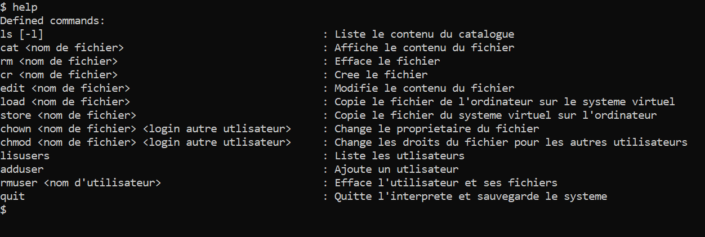

# Projet S4 - L2 Informatique Paul Sabatier  
  
  
  ## Ce projet à été réalisé par les deux étudiants :  
  
  * Alibert Pierre
  * Kamiche Mohamed Raouf  

<<<<<  *Ceci a été fait dans le cadre de l'UE __PROJET S4__ du semestre 4 en **Licence informatique**.*  >>>>>>

```diff
-             //\\//\\//\\// Un systeme d'exploitation (très) simplifié UNIX like //\\//\\//\\//          -
```

Dans notre projet on a , un from scratch, c'est un systeme d'exploitation avec des fichiers, des utilisateurs, une procédure
de connexion, un interprète de commande. Le disque dur de la machine sera simule par un fichier qu'on
appellera le disque virtuel, qu'il faudra formater et qui contiendra les fichiers et le catalogue du disque.
Le systeme d'exploitation proprement dit sera un programme C, resident en mémoire, gerant des tables lui 
permettant de gerer un systeme de fichiers, qui sera écrit sur un disque dur simulé, pour le projet,
par un fichier.
Le systeme gerera diverses operations sur les fichiers, une table des utilisateurs, des droits (simplifies)
de ces derniers sur les fichiers, une procedure de connexion et un interprete de commande.
Comme il est d'usage en système, la logique de fonctionnement sera divisee en couches .

_________________________________   **Comment lancer le système d'exploitation**  ___________________________________  


   //\\//\\//\\//\\//\\==========>> Faudra d'abord télécharger la liste des fichiers qui se trouve dans *ProjetS4*/ .  
   Ouvrir une terminal Unix (Ubuntu,VirtualBox...).  
   Puis se positoner dans le repertoire contenant le projet ensuite veuillez suivre les étapes qui suivent pour bien comprendre le lancement du *système 
   d'exploitation* : 
   
   1- __make__  
   2- __./virtual_os.exe__ *DiskDir*
   
``` diff
!  Une réinstalation du système d'exploitation vas être demandé au lancement du système, pour un premier lancement ceci ne change rien car de toute façon vous aller créez une nouvelle session .

!  Ensuite vous devez choisir un login ( différent de 0 )

! Saissez un mot de passe pour votre login

+ C'est bon vous avez bien créer votre session maintenant vous pouvez vous connecter à votre session en utilisant votre Login et Mot de passe


```

Voici la liste des commandes que vous pouvez utilisés sur le Scratch OS , c'est possible de consulter la liste aussi en tappant la commande '__help__'
  
  

